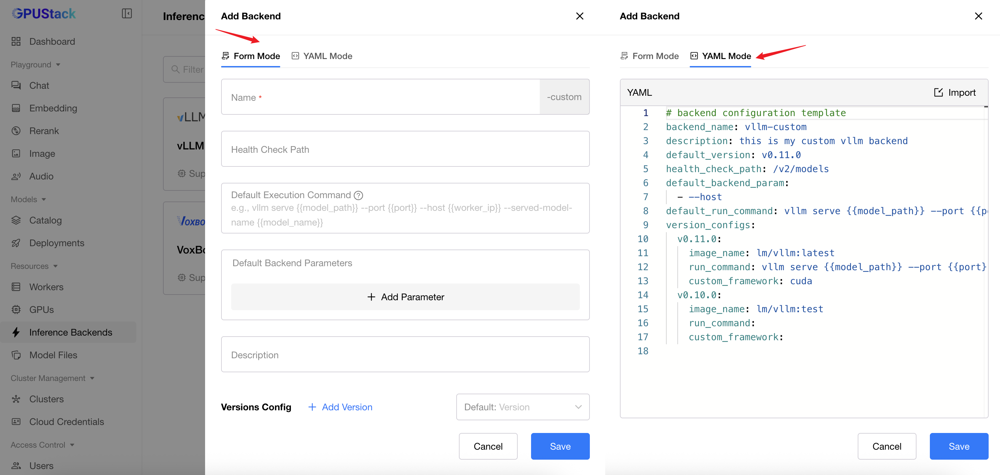
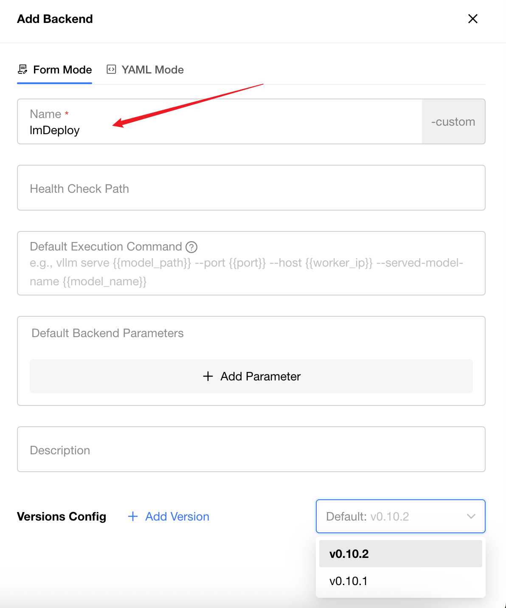
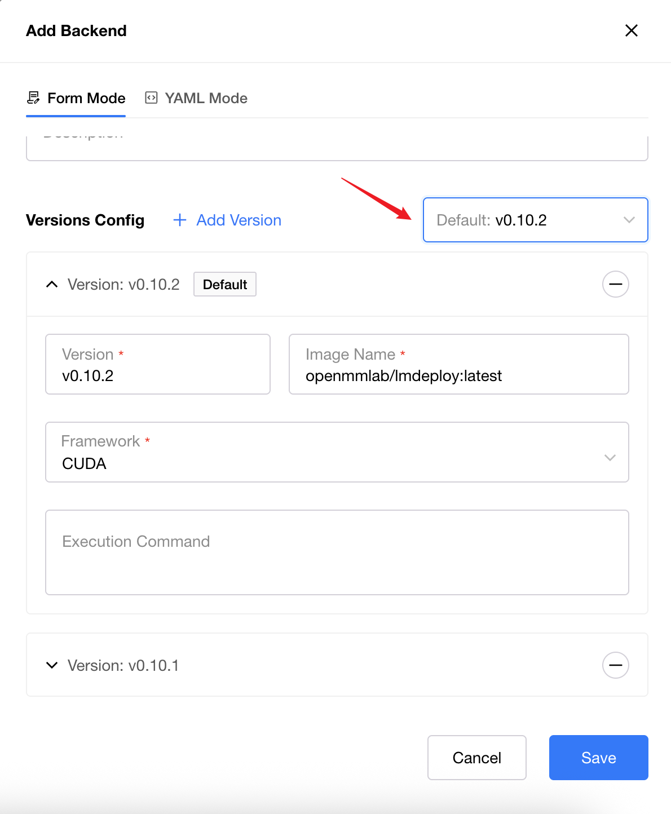
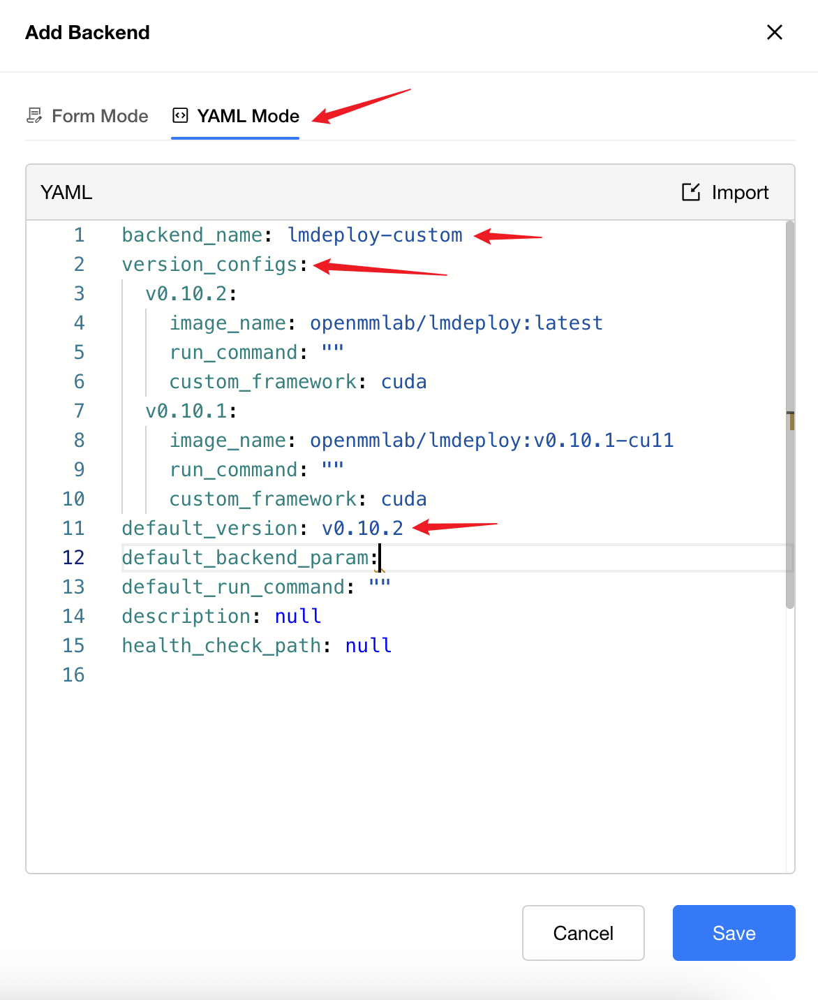
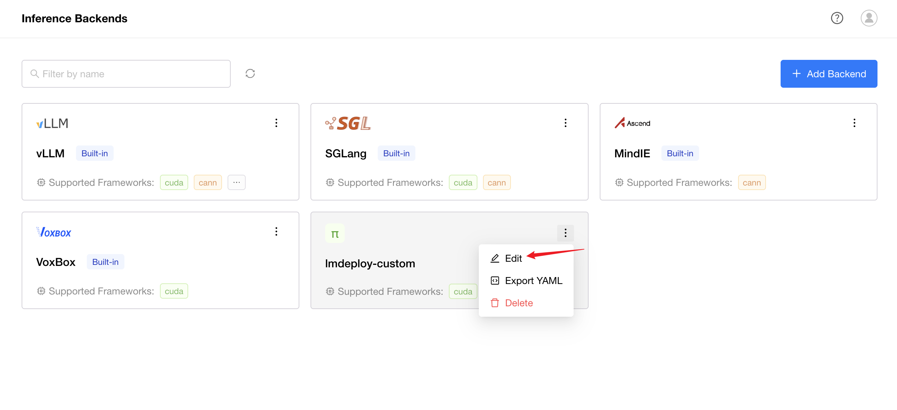
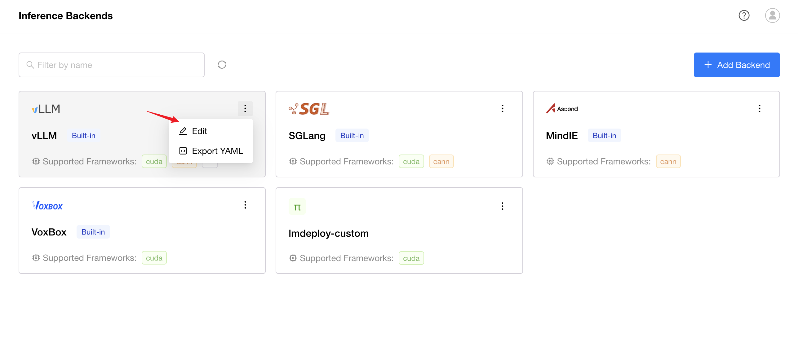
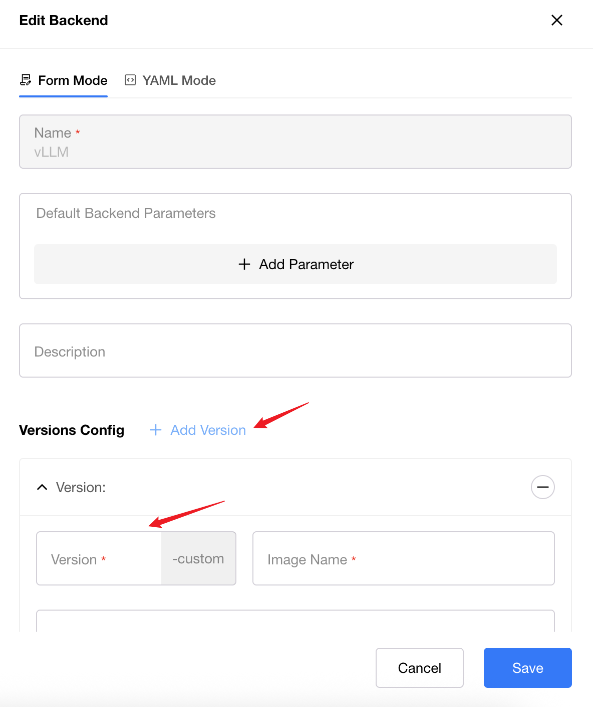
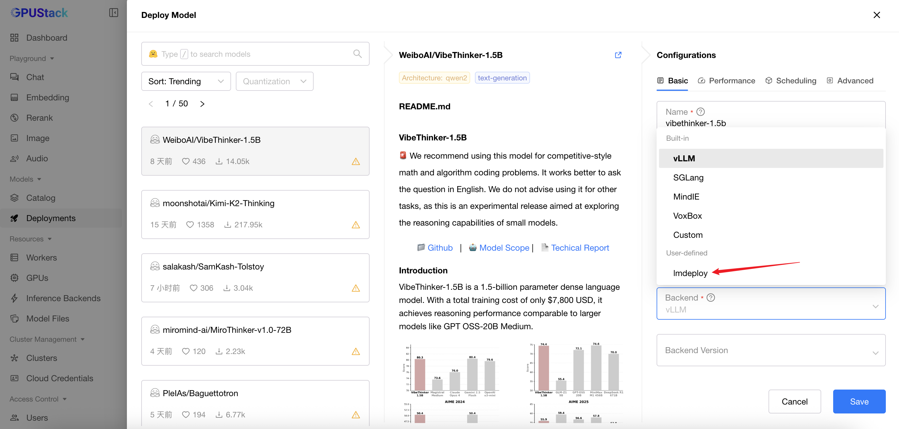

# Inference Backend Management

GPUStack provides a flexible way to manage inference backends. The system includes several built-in backends — **vLLM**, **SGLang**, **MindIE**, and **VoxBox** — and also allows you to add your own custom backends.

- To learn more about the capabilities of supported built-in backends, refer to [Built-in Inference Backends](built-in-inference-backends.md).

- For custom backends that have been validated as compatible, see [Custom Inference Backends](../tutorials/using-custom-backends.md).

## Parameter Description

| Parameter Name             | Description                                                                                                                                                                                                                                                                                                                                                                                              | Required |
|----------------------------|----------------------------------------------------------------------------------------------------------------------------------------------------------------------------------------------------------------------------------------------------------------------------------------------------------------------------------------------------------------------------------------------------------|----------|
| Name                       | Inference backend name                                                                                                                                                                                                                                                                                                                                                                                   | Yes      |
| Health Check Path          | Health check path used to verify if the inference backend has started and is running properly. Default value is /v1/models (OpenAI API specification)                                                                                                                                                                                                                                                    | No       |
| Default Execution Command  | Execution command passed as `args` when the inference backend container starts. For example, for vllm backend, this would be `vllm serve {{model_path}} --port {{port}} --served-model-name {{model_name}} --host {{worker_ip}}`. Note that this command supports {{model_path}}, {{model_name}}, {{port}}, {{worker_ip}} templates, allowing automatic substitution of model path and port number and model name(optional) after scheduling | No       |
| Default Backend Parameters | Default backend parameters used to pre-fill Advanced-Backend Parameters during deployment for convenient deployment and adjustment                                                                                                                                                                                                                                                                       | No       |
| Description                | Description                                                                                                                                                                                                                                                                                                                                                                                              | No       |
| Version Configs            | Inference backend version configurations, used to add inference backend versions                                                                                                                                                                                                                                                                                                                         | Yes      |
| Default Version            | Dropdown option used to pre-fill during deployment. If no version is selected during deployment, the image corresponding to Default Version will be used                                                                                                                                                                                                                                                 | No       |

Version Configs parameter description:

| Parameter Name                  | Description                                         | Required |
|---------------------------------|-----------------------------------------------------|----------|
| Version                         | Version name, displayed in BackendVersion options during deployment | Yes      |
| Image Name                      | Inference backend image name                         | Yes      |
| Framework (custom_framework) | Inference backend framework. Deployment and scheduling will filter based on supported Frameworks | Yes      |
| Execution Command               | Execution command for this version. If not set, uses Default Execution Command | No       |

## Backend List

You can browse and manage inference backends on the `Inference Backend Management` page.
The list supports filtering by backend name.

The screenshot below shows the Backends page:

## Create Backend

1. Navigate to the `Inference Backend Management` page.
2. Click `Add Backend`.
3. Choose between **Form Mode** and **YAML Mode**.
4. Newly created backends automatically append the suffix **-custom**.
5. Every backend must contain at least one version.

### Form Mode

1. Fill the backend `Name` and add at least one `Version`.

**Add Versions**

1. Specify the `Version` and its corresponding `Image Name`.
2. Select a `Framework` that is supported by the image and appropriate for the target device.
3. When multiple versions exist, you may designate one as the **default version**.
4. Click the `Save` button.

### Yaml Mode

Click the `Yaml Mode` tab at the top of the modal.

1. Fill in the `backend_name` and `version_configs` fields. default_version is optional.
2. The backend name must be endwith **-custom**.
2. Click the `Save` button.

## Update Custom Backend

1. Navigate to the `Inference Backend Management` page.
2. Find the backend you want to edit.
3. Hover over the card's dropdown button.
3. Click the `Edit` button in the dropdown.
4. Update the editable attributes in **Form Mode** or **YAML Mode**.
5. Click the `Save` button.

## Update Built-in Backend

1. Navigate to the `Inference Backend Management` page.
2. Find the backend you want to edit.
3. Hover over the card's dropdown button.
3. Click the `Edit` button in the dropdown.
4. Update the editable attributes in **Form Mode** or **YAML Mode**:

    - For built-in backends, adding versions is optional.
    - However, built-in backends cannot set a default version.

5. Click the `Save` button.

## Delete Backend

1. Navigate to the `Inference Backend Management` page.
2. Find the backend you want to delete.(Built-in backends cannot be deleted.)
3. Hover over the card’s dropdown button.
3. Click the `Delete` button in the dropdown.
4. Confirm the deletion.

## View Versions

1. Navigate to the `Inference Backend Management` page.
2. Click the backend card you want to inspect.
3. Filter versions by framework if needed.
4. For built-in backends, both built-in and custom-added versions will be displayed.

## Use Inference Backend

1. Navigate to the `Deployments` page.
2. Click the `Deploy Model`, then select `Hugging Face` in the dropdown.
3. Search the model you want to deploy.
4. In the Backend dropdown, you will see two groups:
    - **Built-in**
    - **User-defined** (your custom backends)
5. Select a backend version if needed. The version list includes both built-in and custom versions.

